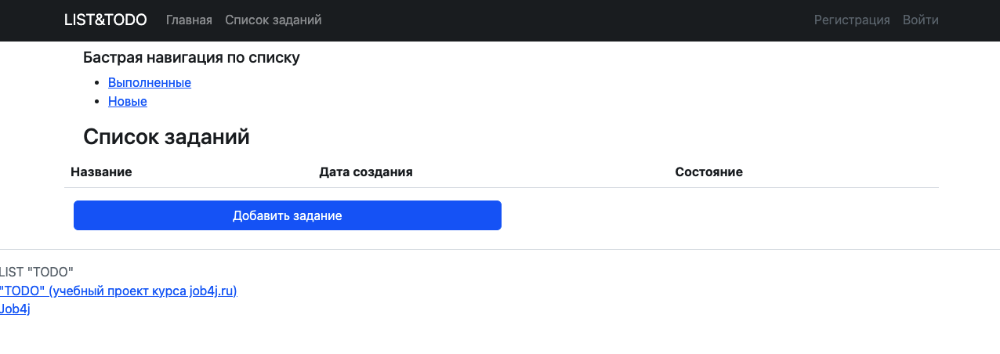
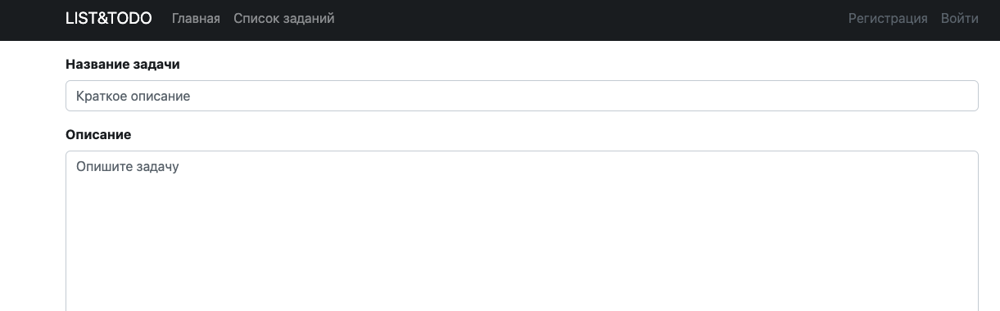

# job4j_todo

## О проекте

Этот проект - приложение "TODO список".

Стек технологий: Spring boot, Thymeleaf, Bootstrap, Hibernate, PostgreSql
Мы будем использовать Spring (в частности Spring MVC и Spring Boot), как основной фреймворк

## Запуск проекта

Для успешной сборки и работы проекта на вашем компьютере должны быть установлены:
JDK 17(+), Maven, PostgreSQL, Tomcat
В PostgreSQL создайте базу с именем "job4j_todo"
Скачайте проект к себе на компьютер с помощью команды
git clone https://github.com/Helgacom/job4j_todo.git

``` Todo db connection ```

Выполните команду mvn install в корне проекта для его сборки

С помощью Liquibase произайдёт миграция БД.
В случае успешной сборки появится файл target/job4j_todo-<version>.war
переименуйте его в todo.war

Для запуска веб-приложения вам нужно скопировать todo.war в папку webapps вашего Tomcat
После запуска сервера приложение будет доступно по адресу
http://localhost:8080/todo/

## Взаимодействие с приложением

приложение включает:

- стартовую страницу со списком всех заданий;
- навигацию по списку в разрезе новых и выполненных задач;
- возможность добавить новую и отредактировать уже имеющуюся в списке задачу;
- получить подробное описание задачи;
- возможность отметить задачу, как выполненную
- возможность регистрации/входа пользователя

start


main list


creation page
